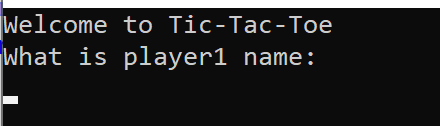
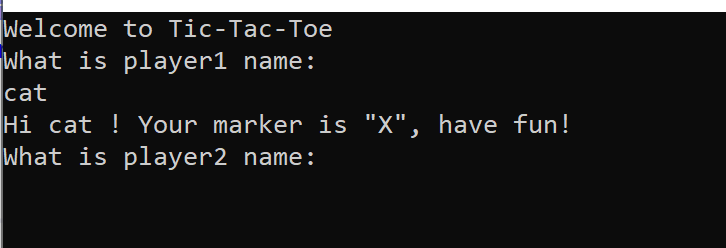
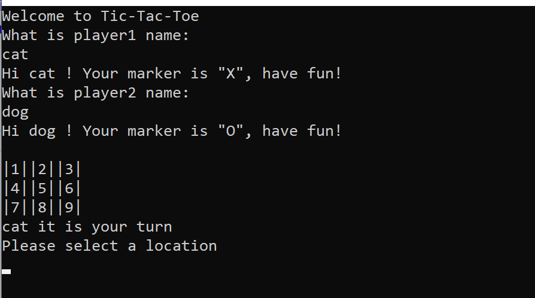
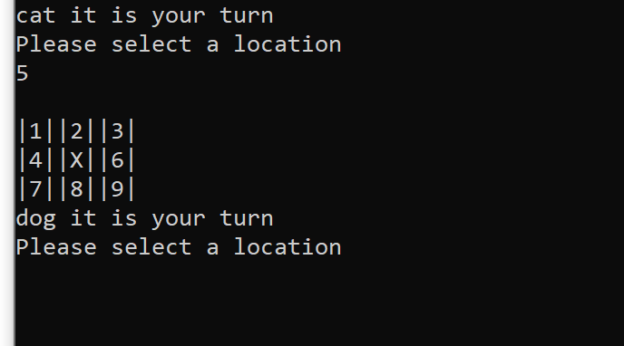
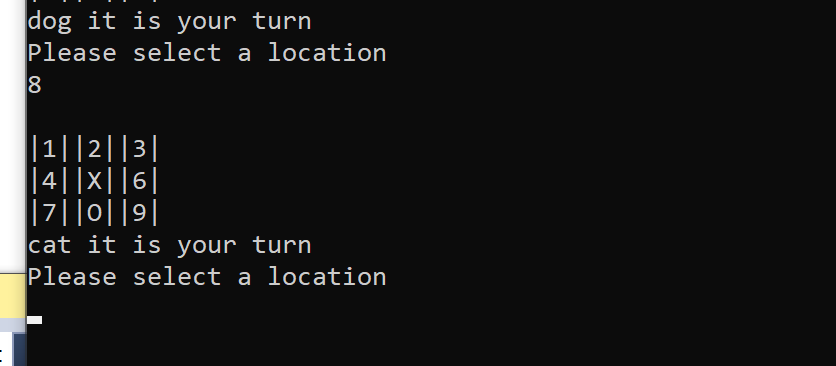
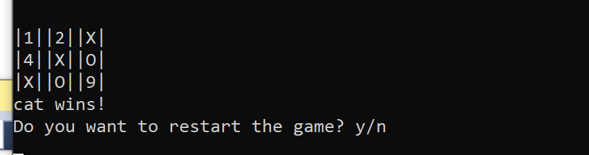

# Lab-04-Tic-Tac-Toe

This is a game with two players. User will be able to name player1 and player2 and start to play, each player will choose a spot (1-9) on
the board.

If player1 chooses a spot, it will turn to marker "X" on that spot, player2 is "O". If happens three straight "X" OR "O" in a row or column or 
diagonal, game over and winner's name will output on the console.

Start page:

After each player knows their marker and now start to pick spot:

When game over, it will tell the name and let you choose whether or not to start a new game

